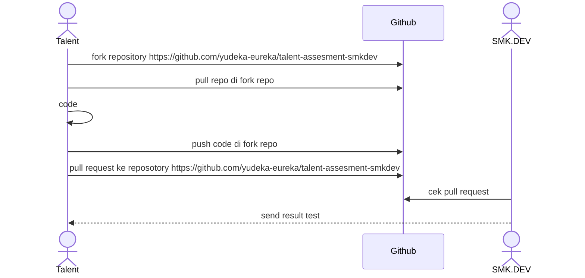

# SMK.DEV Siap Kerja!!!

SMK.DEV adalah lembaga pelatihan yang menciptakan talenta digital global. Belajar langsung dari para ahli industri dengan kurikulum komprehensif berbasis project-based learning, memastikan peserta mendapatkan pengalaman praktis dan pengetahuan mendalam untuk berhasil di dunia digital yang terus berkembang.

# Proses Test Coding

1. **Tahapan Test** :
   Sebelum dapat disalurkan sebagai talenta digital, Anda akan melalui beberapa tahap tes untuk memastikan kesiapan dan kecocokan Anda.
2. **Salah Satunya Adalah Tes Koding** :
   Salah satu tahap penting adalah tes koding, yang dirancang untuk mengukur kemampuan teknis Anda secara menyeluruh.
3. **Tujuan Tes Koding** :
   Tes koding ini bertujuan untuk memvalidasi keterampilan Anda sehingga sesuai dengan kebutuhan spesifik dari klien yang akan Anda hadapi.
4. **Pengumuman Hasil Tes Koding** :
   Hasil dari tes koding akan diumumkan dalam waktu 1x24 jam setelah tes dilakukan.

## Process Test Coding



# Cara Coding

1. Pull repository yang dari fork repo
2. Coding di fungsi yang sudah di sediakan contoh
   ```
   function WeightedStrings(keyword,query) {
        //code disini
   }
   ```
3. Buat commit sesuai dengan standar [conventional commit](https://www.conventionalcommits.org/en/v1.0.0/)
4. Runnig code dengan menggunakan **unit testing**
5. Push code
6. Pull request ke repository fork
7. Jika ada pertanyaan silahkan buat issue di [github](https://github.com/yudeka-eureka/talent-assesment-smkdev)

## Ikuti Kami di Media Sosial

- [WebSite](https://www.smk.dev/)
- [Instagram](https://www.instagram.com/smkdev.official/)
- [LinkedIn](https://www.linkedin.com/in/username)
- [YouTube](https://www.youtube.com/@smkdev)
- [GitHub](https://github.com/smkdev-id)


## Kompleksitas dari Fungsi `balanceBracket`

### Kompleksitas Waktu (Time Complexity)

- **Kompleksitas Waktu**: Fungsi `balanceBracket` memiliki kompleksitas waktu **O(n)**, di mana `n` adalah panjang string `a` yang diberikan sebagai input.
- **Perulangan**: Fungsi melakukan satu kali perulangan melalui string `a` dari awal hingga akhir, sehingga memerlukan waktu **O(n)**.
- **Operasi pada Stack**: Setiap operasi `push` dan `pop` pada stack memiliki kompleksitas waktu **O(1)**, yang berarti operasi ini konstan dan tidak tergantung pada ukuran stack.

**Kesimpulan**: Karena fungsi melakukan pemeriksaan setiap karakter sekali dan setiap operasi pada stack (push/pop) konstan, keseluruhan kompleksitas waktu adalah **O(n)**.

### Kompleksitas Ruang (Space Complexity)

- **Kompleksitas Ruang**: Kompleksitas ruang fungsi ini adalah **O(n)** dalam kasus terburuk.
- **Stack**: Dalam kasus terburuk, jika semua karakter dalam string adalah braket buka (`(`, `{`, `[`), maka stack akan menyimpan hingga `n/2` elemen. Namun, dalam notasi big-O, ini masih dianggap sebagai **O(n)**.

**Kesimpulan**:

- **Time Complexity**: **O(n)**
- **Space Complexity**: **O(n)**
