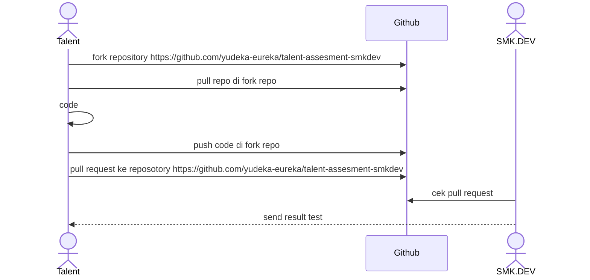

# SMK.DEV Siap Kerja!!!

SMK.DEV adalah lembaga pelatihan yang menciptakan talenta digital global. Belajar langsung dari para ahli industri dengan kurikulum komprehensif berbasis project-based learning, memastikan peserta mendapatkan pengalaman praktis dan pengetahuan mendalam untuk berhasil di dunia digital yang terus berkembang.

# Proses Test Coding

1.	**Tahapan Test** : 
Sebelum dapat disalurkan sebagai talenta digital, Anda akan melalui beberapa tahap tes untuk memastikan kesiapan dan kecocokan Anda.
2.	**Salah Satunya Adalah Tes Koding** : 
Salah satu tahap penting adalah tes koding, yang dirancang untuk mengukur kemampuan teknis Anda secara menyeluruh.
3.	**Tujuan Tes Koding** : 
Tes koding ini bertujuan untuk memvalidasi keterampilan Anda sehingga sesuai dengan kebutuhan spesifik dari klien yang akan Anda hadapi.
4.	**Pengumuman Hasil Tes Koding** :
Hasil dari tes koding akan diumumkan dalam waktu 1x24 jam setelah tes dilakukan.

## Process Test Coding


# Cara Coding

1. Pull repository yang dari fork repo
2. Coding di fungsi yang sudah di sediakan contoh 
   ``` 
   function WeightedStrings(keyword,query) {
        //code disini
   } 
   ```
3. Buat commit sesuai dengan standar [conventional commit](https://www.conventionalcommits.org/en/v1.0.0/)
4. Runnig code dengan menggunakan **unit testing**
5. Push code
6. Pull request ke repository fork
7. Jika ada pertanyaan silahkan buat issue di [github](https://github.com/yudeka-eureka/talent-assesment-smkdev)


## Ikuti Kami di Media Sosial

- [WebSite](https://www.smk.dev/)
- [Instagram](https://www.instagram.com/smkdev.official/)
- [LinkedIn](https://www.linkedin.com/in/username)
- [YouTube](https://www.youtube.com/@smkdev)
- [GitHub](https://github.com/smkdev-id)
  


## Pembahasan Kompleksitas Waktu dan Ruang untuk *Balance Bracket*

### Kompleksitas Waktu: O(n)

    Dalam pemrosesan tiap karakter dimulai dari pertanyaan, apakah setiap karakter dalam string seimbang atau tidak? jadi kita perlu memeriksa setiap karakter setidaknya sekali. 
    Oleh karena itu, kompleksitas waktu minimum yang diperlukan untuk mengoperasikan iterasi pada string adalah O(n), dimana n adalah panjang string, sementara untuk operasi stack (push dan pop) disini 
    adalah O(1) per operasi, dimana kita hanya memproses setiap karakter sekali, jadi total waktu yang diperlukan untuk stack juga O(n).

### Kompleksitas Ruang: O(n)

    Operasi stack dalam kasus terburuk, jika semua karakter adalah tanda kurung buka dan tidak ada tanda kurung penutup yang sesuai, stack bisa memuat hingga n elemen. 
    Oleh karena itu, penggunaan ruang stack maksimum adalah O(n) dan penggunaan map untuk pasangan tanda ( ), { }, atau [ ] memerlukan ruang konstan, O(1).