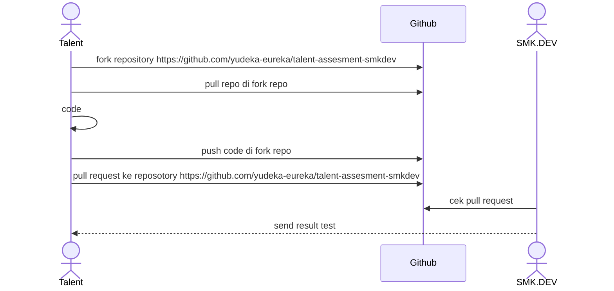

# SMK.DEV Siap Kerja!!!

SMK.DEV adalah lembaga pelatihan yang menciptakan talenta digital global. Belajar langsung dari para ahli industri dengan kurikulum komprehensif berbasis project-based learning, memastikan peserta mendapatkan pengalaman praktis dan pengetahuan mendalam untuk berhasil di dunia digital yang terus berkembang.

# Proses Test Coding

1. **Tahapan Test** :
   Sebelum dapat disalurkan sebagai talenta digital, Anda akan melalui beberapa tahap tes untuk memastikan kesiapan dan kecocokan Anda.
2. **Salah Satunya Adalah Tes Koding** :
   Salah satu tahap penting adalah tes koding, yang dirancang untuk mengukur kemampuan teknis Anda secara menyeluruh.
3. **Tujuan Tes Koding** :
   Tes koding ini bertujuan untuk memvalidasi keterampilan Anda sehingga sesuai dengan kebutuhan spesifik dari klien yang akan Anda hadapi.
4. **Pengumuman Hasil Tes Koding** :
   Hasil dari tes koding akan diumumkan dalam waktu 1x24 jam setelah tes dilakukan.

## Process Test Coding



# Cara Coding

1. Pull repository yang dari fork repo
2. Coding di fungsi yang sudah di sediakan contoh
   ```
   function WeightedStrings(keyword,query) {
        //code disini
   }
   ```
3. Buat commit sesuai dengan standar [conventional commit](https://www.conventionalcommits.org/en/v1.0.0/)
4. Runnig code dengan menggunakan **unit testing**
5. Push code
6. Pull request ke repository fork
7. Jika ada pertanyaan silahkan buat issue di [github](https://github.com/yudeka-eureka/talent-assesment-smkdev)

## Ikuti Kami di Media Sosial

- [WebSite](https://www.smk.dev/)
- [Instagram](https://www.instagram.com/smkdev.official/)
- [LinkedIn](https://www.linkedin.com/in/username)
- [YouTube](https://www.youtube.com/@smkdev)
- [GitHub](https://github.com/smkdev-id)


# _Explanation_ of the complexity analysis for answer Balanced Bracket

## Time Complexity

Fungsi ini memiliki dua bagain utama yaitu makePalindrome dan maximizePalindrome yang dibuat dengan Anonymous Function.

- Initialization Variables O(n)

```
    chars := []rune(s)  // O(n)
    n := len(chars)     // O(1)
    changes := make([]bool, n) // O(n)
```

Proses ini dilakukan sekali, dimana pada saat membuat variable chars dengan type data array of string dan variable changes dengan tipe data bool. Proses ini memerlukan waktu O(n), dimana n adalah panjang input string.

- Function makePalindrome dan maximizePalindrome O(n)

```
    makePalindrome = func(left, right int) bool {
        // ...
        return makePalindrome(left+1, right-1)  // O(n)
    }
```

```
    maximizePalindrome = func(left, right int) string {
        // ...
        return maximizePalindrome(left+1, right-1) // O(n)
    }
```

Fungsi ini dibuat dengan teknik rekursif untuk memriksa setiap pasangan karakter dari kiri dan kanan dengan bantuan flagging/pointer variable left dan right. Fungsi ini akan dipanggil sebanyak n/2 kali karena dua indeks bergerak menuju tengah, menghasilkan time cmplexity O(n).

- Kesimpulan
  Total Time Complexity dari fungsi highestPalindrome adalah O(n), di mana n adalah panjang string input. Hal ini disebabkan oleh dua fungsi rekursif (makePalindrome dan maximizePalindrome) yang masing-masing berjalan secara linear.

## Space Complexity

- Initialization Variables O(n)

```
    chars := []rune(s)  // O(n)
    changes := make([]bool, n) // O(n)
```

Penyimpanan value pada variable chars dan changes memerlukan ruang O(n).

- Initialization Function Recursive O(n)
  Fungsi rekursif menggunakan teknik Stack untuk menyimpan status setiap fungsi dipanggil, sehingga ruang yang digunakan bisa mencapai n/2 atau O(n).
