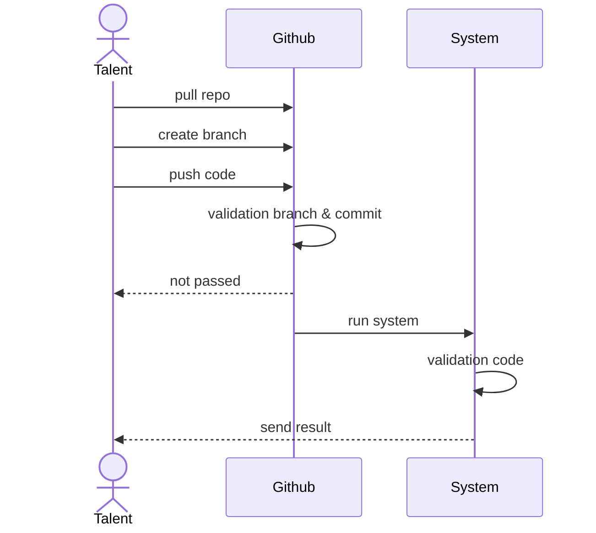

# SMK.DEV Siap Kerja!!!

SMK.DEV adalah lembaga pelatihan yang menciptakan talenta digital global. Belajar langsung dari para ahli industri dengan kurikulum komprehensif berbasis project-based learning, memastikan peserta mendapatkan pengalaman praktis dan pengetahuan mendalam untuk berhasil di dunia digital yang terus berkembang.

# Proses Test Coding

1.	**Tahapan Test** : 
Sebelum dapat disalurkan sebagai talenta digital, Anda akan melalui beberapa tahap tes untuk memastikan kesiapan dan kecocokan Anda.
2.	**Salah Satunya Adalah Tes Koding** : 
Salah satu tahap penting adalah tes koding, yang dirancang untuk mengukur kemampuan teknis Anda secara menyeluruh.
3.	**Tujuan Tes Koding** : 
Tes koding ini bertujuan untuk memvalidasi keterampilan Anda sehingga sesuai dengan kebutuhan spesifik dari klien yang akan Anda hadapi.
4.	**Pengumuman Hasil Tes Koding** :
Hasil dari tes koding akan diumumkan dalam waktu 1x24 jam setelah tes dilakukan.

## Process Test Coding


# Cara Coding

1. Pull repository yang sudah tersedia
2. Buat branch dengan format `<nama_depan>-<programming>` contoh `sudar-php`
3. Coding di fungsi yang sudah di sediakan contoh 
   ``` 
   function WeightedStrings(keyword,query) {
        //code disini
   } 
   ```
4. Buat commit sesuai dengan standar [conventional commit](https://www.conventionalcommits.org/en/v1.0.0/)
5. Push code ke branch yang sudah dibuat

# Cara Submit

1. Push code ke branch yang sudah di buat
2. System akan memvalidasi branch dan commit 
3. Jika belum sesuai sistem akan mereject
4. Jika sudah sesuai sistem akan memvalidasi code
5. 1x24 jam sistem akan memberitahukan via email hasil test


## Ikuti Kami di Media Sosial

- [WebSite](https://www.smk.dev/)
- [Instagram](https://www.instagram.com/smkdev.official/)
- [LinkedIn](https://www.linkedin.com/in/username)
- [YouTube](https://www.youtube.com/@smkdev)
- [GitHub](https://github.com/smkdev-id)
  


!!!UPDATE DISINI
