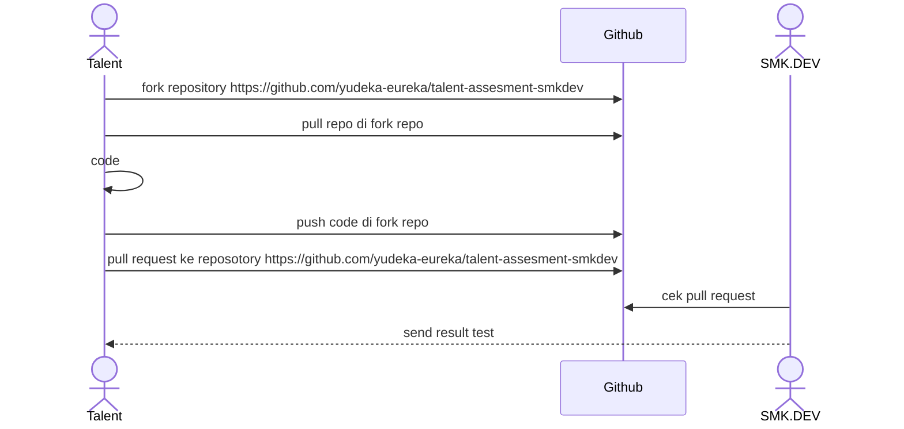

# SMK.DEV Siap Kerja!!!

SMK.DEV adalah lembaga pelatihan yang menciptakan talenta digital global. Belajar langsung dari para ahli industri dengan kurikulum komprehensif berbasis project-based learning, memastikan peserta mendapatkan pengalaman praktis dan pengetahuan mendalam untuk berhasil di dunia digital yang terus berkembang.

# Proses Test Coding

1.	**Tahapan Test** : 
Sebelum dapat disalurkan sebagai talenta digital, Anda akan melalui beberapa tahap tes untuk memastikan kesiapan dan kecocokan Anda.
2.	**Salah Satunya Adalah Tes Koding** : 
Salah satu tahap penting adalah tes koding, yang dirancang untuk mengukur kemampuan teknis Anda secara menyeluruh.
3.	**Tujuan Tes Koding** : 
Tes koding ini bertujuan untuk memvalidasi keterampilan Anda sehingga sesuai dengan kebutuhan spesifik dari klien yang akan Anda hadapi.
4.	**Pengumuman Hasil Tes Koding** :
Hasil dari tes koding akan diumumkan dalam waktu 1x24 jam setelah tes dilakukan.

## Process Test Coding


# Cara Coding

1. Pull repository yang dari fork repo
2. Coding di fungsi yang sudah di sediakan contoh 
   ``` 
   function WeightedStrings(keyword,query) {
        //code disini
   } 
   ```
3. Buat commit sesuai dengan standar [conventional commit](https://www.conventionalcommits.org/en/v1.0.0/)
4. Runnig code dengan menggunakan **unit testing**
5. Push code
6. Pull request ke repository fork
7. Jika ada pertanyaan silahkan buat issue di [github](https://github.com/yudeka-eureka/talent-assesment-smkdev)

# penjelasan Complecity Code untuk case Balanced brackets
1. Time Complexity
pada funcsi balancedBracket melakukan proses baca string per satu karakter. tahapan pada proses ini sebagai berikut:

    1. Iterasi string berdasarkan panjang karakter pada inputan, untuk biaya waktu-nya adalah **O(n)**
    2. Operasi Stack, setiap kali menemukan bracket pembuka `(` `{` `[` akan ditambahkan pada stack (operasi pop), dan setiap kali menemui tanda bracket penutup `)` `}` `]` stack akan diperiksa apakah bernilai kosong atau tidak, apa bila eleman paling atas stack sesuai dengan bracket penutup maka akan melakukan operasi POP/menghapus elemen terakhir pada stack

jadi, total kompelsitas waktu adalah **O(n)**

a. **O(n)** untuk iterasi string karena semua karakter hanya diproses sekali, operasi push dan pop dilakukan sekali per element sehingga nilai biaya juga **O(n)** 

2. Space Complexity
komplesitas ruang, tergantung berapa banyak element yang akan disimpan pada stack, contoh dalam kasus terburuk jika nilai inputan merupakan semua bracket pembuka, maka semua elemen akan ditambahkan ke stack, sehingga element stack berisi `n` element. sehingga ruang yang digunakan oleh stack sebesar **O(n)**, sedangkan ruang untuk Map yang digunakan adalah sebuah map statis untuk menyinpan pasangan bracket yang bernilai selalu konstan (hanya 3 pasang karakter) sehingga memiliki kompleksitas ruang **O(1)**.

### Kesimpulan
1. Time Complexity **O(n)**
2. Space Complecity **O(n)**


## Ikuti Kami di Media Sosial

- [WebSite](https://www.smk.dev/)
- [Instagram](https://www.instagram.com/smkdev.official/)
- [LinkedIn](https://www.linkedin.com/in/username)
- [YouTube](https://www.youtube.com/@smkdev)
- [GitHub](https://github.com/smkdev-id)
  

