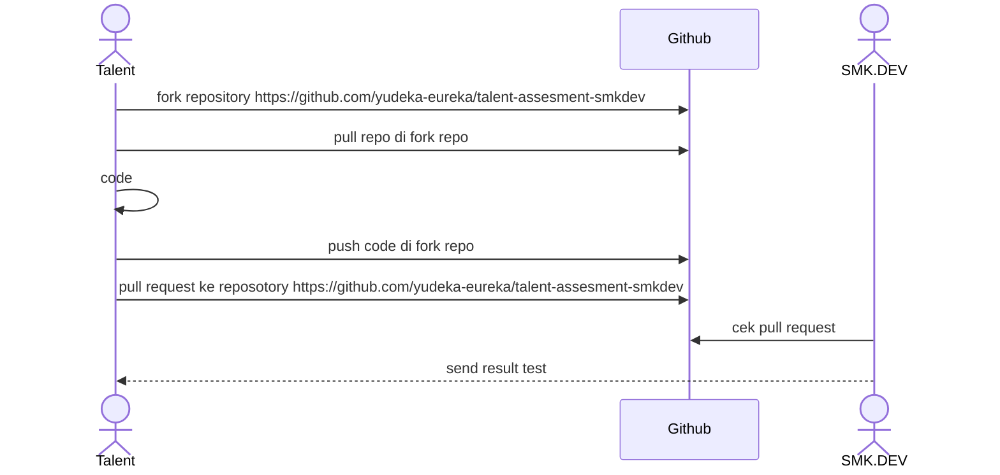

# SMK.DEV Siap Kerja!!!

SMK.DEV adalah lembaga pelatihan yang menciptakan talenta digital global. Belajar langsung dari para ahli industri dengan kurikulum komprehensif berbasis project-based learning, memastikan peserta mendapatkan pengalaman praktis dan pengetahuan mendalam untuk berhasil di dunia digital yang terus berkembang.

# Proses Test Coding

1.	**Tahapan Test** : 
Sebelum dapat disalurkan sebagai talenta digital, Anda akan melalui beberapa tahap tes untuk memastikan kesiapan dan kecocokan Anda.
2.	**Salah Satunya Adalah Tes Koding** : 
Salah satu tahap penting adalah tes koding, yang dirancang untuk mengukur kemampuan teknis Anda secara menyeluruh.
3.	**Tujuan Tes Koding** : 
Tes koding ini bertujuan untuk memvalidasi keterampilan Anda sehingga sesuai dengan kebutuhan spesifik dari klien yang akan Anda hadapi.
4.	**Pengumuman Hasil Tes Koding** :
Hasil dari tes koding akan diumumkan dalam waktu 1x24 jam setelah tes dilakukan.

## Process Test Coding


# Cara Coding

1. Pull repository yang dari fork repo
2. Coding di fungsi yang sudah di sediakan contoh 
   ``` 
   function WeightedStrings(keyword,query) {
        //code disini
   } 
   ```
3. Buat commit sesuai dengan standar [conventional commit](https://www.conventionalcommits.org/en/v1.0.0/)
4. Runnig code dengan menggunakan **unit testing**
5. Push code
6. Pull request ke repository fork
7. Jika ada pertanyaan silahkan buat issue di [github](https://github.com/yudeka-eureka/talent-assesment-smkdev)


## Ikuti Kami di Media Sosial

- [WebSite](https://www.smk.dev/)
- [Instagram](https://www.instagram.com/smkdev.official/)
- [LinkedIn](https://www.linkedin.com/in/username)
- [YouTube](https://www.youtube.com/@smkdev)
- [GitHub](https://github.com/smkdev-id)
  


# 1. Weighted Strings

- Deskripsi :
Fungsi weighted strings yaitu untuk menghitung nilai bobot substring alphabet sesuai dengan posisi ordinal nya dan sesuai dengan yang dideklarasikan di file main_test.go. Jika nilai result nya sama dengan alpahbet tersebut ditandai dengan "YES" jika tidak di tandai dengan "NO".

- Penyelesaian : 
Membuat fungsi untuk membandingkan atau membaca result result yang telah dideklarasikan di file main_test.go sehingga jika di unit test terbaca semua dan tidak error seperti di func weightedStrings file main.go

Dengan memmbuat map untuk menyimpan nilai bobot alphabet tersebut dihitung perkarakter/string, setelah mendapat result nya maka akan diperiksa apakah hasil tersebut sesuai dengan yang di inputkan di expected di main_test.go 

# 2. Balanced Bracket 

- Deskripsi :
Fungsi balanced bracket ini membaca setiap stack atau { }, [ ], dan ( ) sehingga reusltnya seimbang antara kurung buka dan tutup.

- Penyelesaian : 
Membuat fungsi perbandingan yang membaca tanda kurung buka dan penutup bernilai/berjumlah atau tidak. Jika seimbang maka result "YES" jika tidak result "NO" dan membaca sesuai dengan yang dideklarasikan di main_test.go. Ditambah jug adengan fungsi untuk replace karkater lain selain { }, [ ], dan ( ) agar menghasilkan result sesuai expected.

# 3. Highest Palindrome

- Deskripsi : 
Fungsi highest palindrome untuk menghasilkan nilai tertinggi dari string/s dengan maksimalisasi dari nilai k atau dikembalikan ke nilai -1

- Penyelesaian : 
Dengan membuat fungsi yang mengecek digit karakter digit atau non-digit. Setelah itu konversi string untuk mengintegrasi nilai ujung kanan kiri ke tengah maka perubahan itu menjadi palindrome. Fungsi ini membaca sesuai dengan yang dideklarasikan string dan k di file main_test.go
 